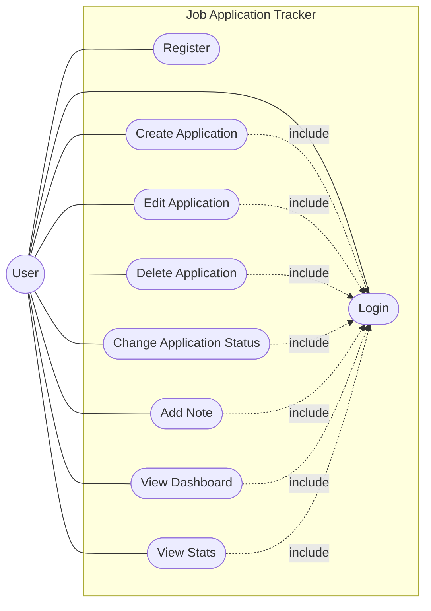

# Job Application Tracker — Use Case Diagram

## Actor
- **User** (the only actor — see requirements doc, section 2)

## Use Case → Functional Requirement Traceability

| Use Case | Traces to |
|---|---|
| Register | FR1 |
| Login | FR2 |
| Create Application | FR3 |
| Edit Application | FR3 |
| Delete Application | FR3 |
| Change Application Status | FR4 |
| Add Note | FR5 |
| View Dashboard | FR6 |
| View Stats | FR7 |

Every functional requirement maps to exactly one use case, and every use
case traces back to a requirement — no orphaned features, nothing in the
requirements doc left unaccounted for. That check is the actual point of
this diagram, more than the picture itself.

## Diagram

## Note on the `<<include>>` relationships
Every use case except Register and Login includes Login — meaning none of
them can happen without an authenticated session first. This isn't just
decoration: it's a direct preview of the backend architecture decision
we'll make soon (a global auth guard on every route except `/auth/register`
and `/auth/login`), and of the frontend routing decision (a route guard /
protected-route wrapper around every page except the login screen). The
diagram is already telling us something about the implementation.
