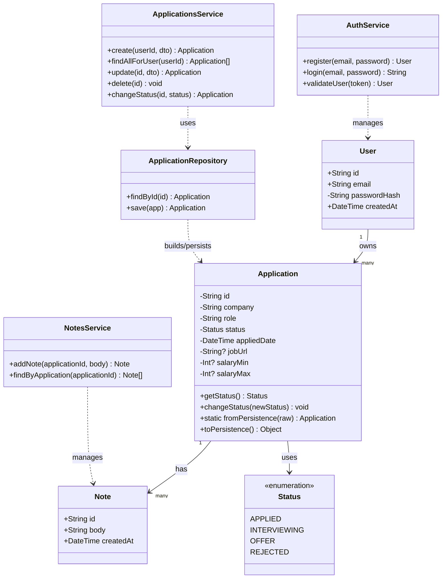

# Job Application Tracker — UML Class Diagram

## Design decision: hybrid domain model
`User` and `Note` are anemic — plain data, no behavior, matching what
Prisma generates directly. `Application` is a **rich** domain object: it
owns its state privately and exposes behavior (`changeStatus()`) that
enforces its one real business rule (a rejected application can't be
reopened). This is a deliberate, asymmetric choice — not every entity
needs to be rich, only the one with an actual invariant worth protecting.

Because Prisma always generates plain (anemic) types from the schema
regardless of this choice, making `Application` rich requires one extra
piece: an `ApplicationRepository` that translates between Prisma's raw
generated shape and our own domain class. Reads build a domain object from
the raw row; writes extract the domain object's state and hand it to
Prisma. This is a lightweight form of the Repository pattern, and it's the
mechanism that lets rich and anemic models coexist in the same codebase
without contradiction.

## Diagram



## Why `changeStatus` moved onto `Application` itself
Compare the two call sites this change produces:

```typescript
// Before (anemic) — rule enforced in the service, easy to forget or duplicate
if (app.status === 'REJECTED' && newStatus !== 'REJECTED') {
  throw new Error('Cannot reopen a rejected application');
}
app.status = newStatus;

// After (rich) — rule is impossible to bypass, lives in exactly one place
app.changeStatus(newStatus);
```

Any code path that changes an application's status — the REST endpoint
today, a future bulk-import feature, a future CLI script — goes through
`Application.changeStatus()` and automatically gets the rule enforced. With
the anemic version, every new call site would need to remember to
re-implement the check.

## Reading notes
- `-passwordHash` uses UML's `-` (private) visibility marker deliberately —
  it signals this field should never leave the backend, a reminder for
  later when we design the API's response DTOs (the password hash must be
  stripped before any response is sent to the client).
- `Application`'s fields are now all `-` (private) too, but for a different
  reason: this is genuine encapsulation. Nothing outside the class should
  read or write `status` directly — it goes through `getStatus()` and
  `changeStatus()` so the invariant can never be bypassed.
- `ApplicationsService` no longer talks to Prisma directly for
  `Application` — it goes through `ApplicationRepository`, which is the
  only place that knows how to convert between Prisma's raw row and the
  domain object (`fromPersistence` / `toPersistence`). `User` and `Note`
  skip this layer entirely and are queried directly via Prisma inside their
  services, since there's no invariant to protect on them.
- The dashed arrows (`..>`) mean "depends on / operates on," as opposed to
  the solid arrows between entities, which mean a structural relationship
  (ownership, composition).
