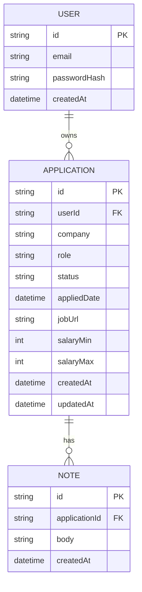

# Job Application Tracker — Entity-Relationship Diagram

## Diagram

## Reading notes
- `USER ||--o{ APPLICATION : owns` — one user, zero or more applications;
  every application belongs to exactly one user. This directly matches the
  `userId` foreign key on `APPLICATION`.
- `APPLICATION ||--o{ NOTE : has` — same shape, one level down: one
  application, zero or more notes; every note belongs to exactly one
  application.
- `status` is a plain `string` column here, not a separate table or a
  connected entity the way it appeared in the class diagram. In the actual
  Prisma schema it'll be a Postgres enum type (`APPLIED` /
  `INTERVIEWING` / `OFFER` / `REJECTED`), which is a database-level
  constraint, not a relationship — so it doesn't get a cardinality line to
  anything.
- No `Status` box, no `AuthService`/`ApplicationsService`/
  `ApplicationRepository` boxes — none of that exists at the storage
  level. If you compare this diagram side-by-side with the class diagram,
  the missing pieces are exactly the things that only exist in code, which
  is a useful gut-check for whether you actually understand the
  distinction rather than just having memorized it.

